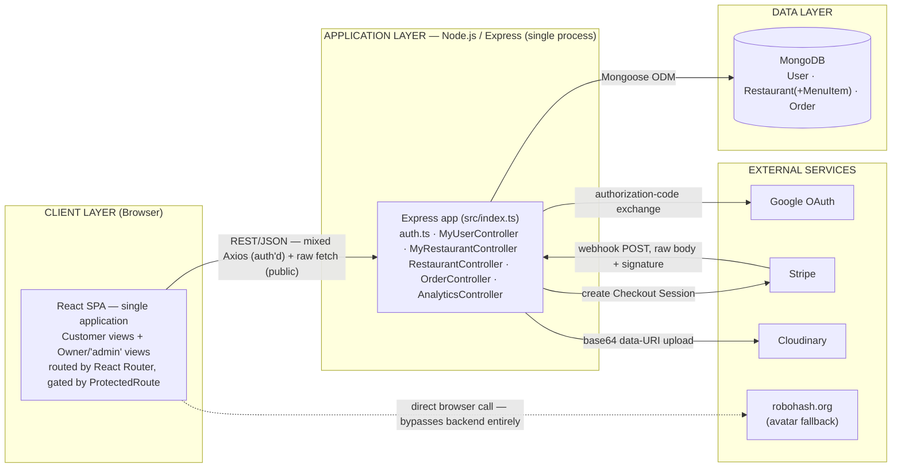
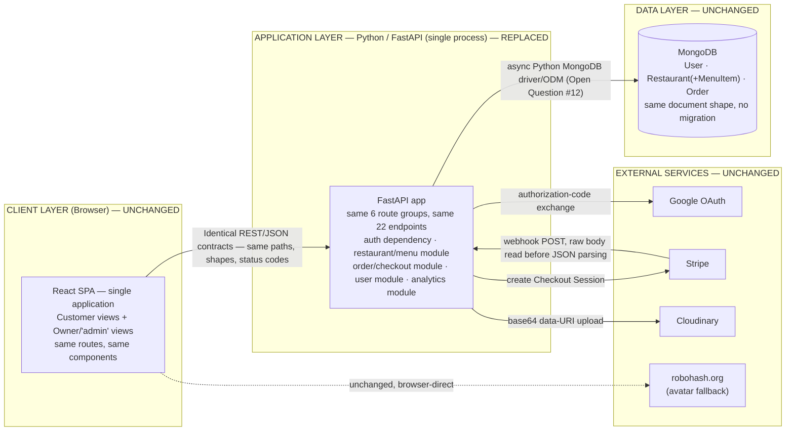
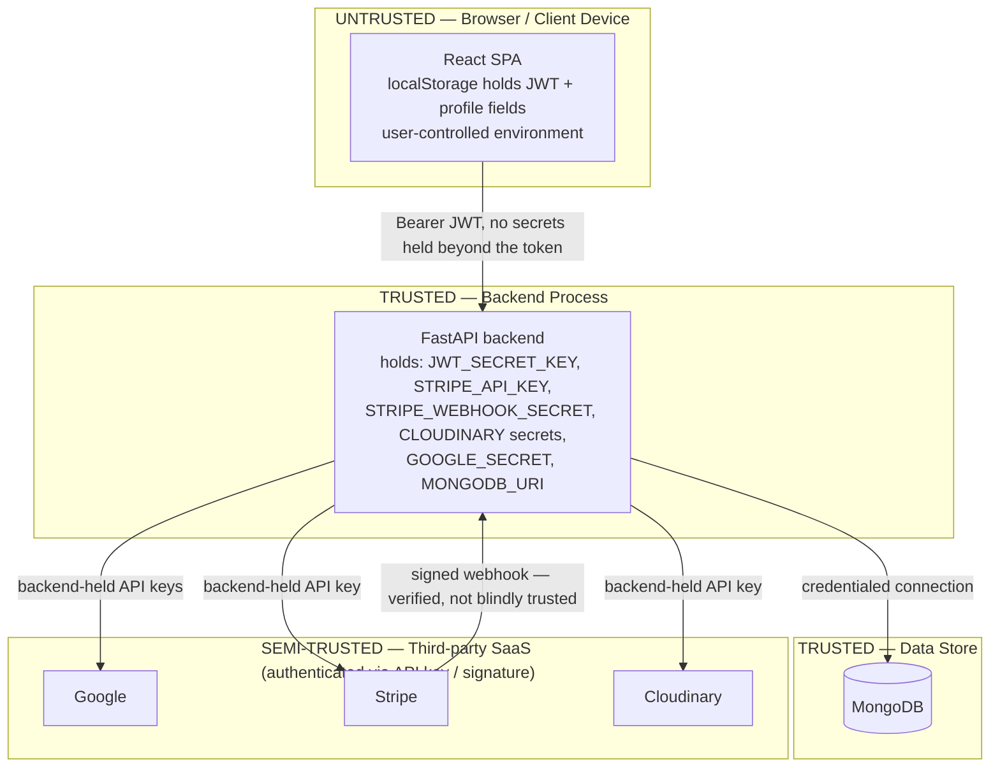

# Target Solution Architecture
## Restaurant Food Ordering Management System — Backend Modernization (Node.js/Express → Python/FastAPI)

**Module:** 2 — Architecture & Solution Design (target architecture)
**Basis:** `ARCHITECTURE_REQUIREMENTS.md` (reviewed), `BRD.md`, `PRD.md`, `CURRENT_STATE.md`.
**Scope decision confirmed with user:** identity/auth is designed around the **confirmed** current mechanism — backend-issued JWT + server-side Google OAuth. Auth0 does not appear in this architecture; it is a stale documentation artifact in the current repo (`ApiStatusPage.tsx`, `.env.example`), not a real integration, and introducing it would contradict the "no new authentication provider" constraint (`BROWNFIELD_UI_UX_HANDOFF.md` §11) unless separately approved.

**Design stance:** this is a **like-for-like incremental modernization** — one deployable frontend, one deployable backend, one database, three external SaaS integrations, same shape as today. No microservices, no message queue (Kafka or otherwise), no container orchestration (Kubernetes), no cache layer (Redis), and no cloud-provider-specific services (AWS or otherwise) are introduced — see [§8 Deliberately Excluded Infrastructure](#8-deliberately-excluded-infrastructure) for why.

---

## 1. Current State Architecture

**Key current-state facts** *(CURRENT_STATE.md)*: single Express process, no service layer, no API gateway, no cache, no queue, no background worker. JWT is self-issued and self-verified by the backend — Google is used only for the OAuth code exchange, not as a token-issuing authority the backend trusts blindly. Two deployment-configuration lineages coexist and it's unconfirmed which is live (Open Question #1, carried into this document).

---

## 2. Target State Architecture

**What changes:** only the box labeled APPLICATION LAYER — the language/framework implementing the same 22 endpoints, same contracts, same external calls.
**What does not change:** the client, the database engine and schema, all four external integrations, and the overall topology (one frontend deployable, one backend deployable, one database).

---

## 3. Client Layer

| | CURRENT STATE | TARGET STATE |
|---|---|---|
| Customer web application | Part of the single React SPA — home, search, detail, checkout, order-status, profile routes. No separate customer app exists. | **Unchanged.** Same SPA, same routes. |
| Restaurant/"admin" interface | **Not a separate application.** `/manage-restaurant` is a protected route inside the *same* SPA, reachable by any authenticated user who chooses to create a restaurant — there is no distinct admin build, subdomain, or deployable. *(CURRENT_STATE.md §4, BROWNFIELD_UI_UX_HANDOFF.md §3)* | **Unchanged.** No new admin app is introduced — doing so would be a frontend change and a scope expansion, both out of scope per `BRD.md` §13. |

**Note for this diagram's labeling:** "Customer web application" and "Restaurant/admin interface" in the requested layout are **logical views inside one client deployable**, not two systems. Presenting them as separate boxes would misrepresent the confirmed architecture.

## 4. Application Layer

The requested capabilities map onto the target FastAPI app as **logical modules within one deployable process** (consistent with "no microservices"), each corresponding to an existing route group:

| Capability | Current (Express) | Target (FastAPI) | Endpoints covered |
|---|---|---|---|
| React frontend | — (client layer) | — (client layer, unchanged) | n/a |
| Backend API (entry/bootstrap) | `src/index.ts` — CORS, cookie-parser, raw-body webhook exception, JSON body parsing, health routes, route mounts | FastAPI app instance with equivalent middleware ordering, especially the raw-body-before-JSON-parsing requirement for the webhook route | `/`, `/health`, `/api/health` |
| Authentication/authorization | `routes/auth.ts`, `middleware/auth.ts` | Auth module: register/login/validate-token/logout handlers + Google OAuth exchange + Bearer-token dependency used by all protected routes | `/api/auth/*` (6 endpoints) |
| User management | `MyUserController.ts` | User-profile module | `/api/my/user/*` (3 endpoints) |
| Restaurant management | `MyRestaurantController.ts` (restaurant CRUD portion) | Restaurant module — create/update/read, multipart parsing, pence conversion, Cloudinary upload, one-restaurant-per-user guard | `/api/my/restaurant` GET/POST/PUT |
| Menu management | Embedded in `MyRestaurantController.ts` (menu items are part of the restaurant document, not a separate resource) | **Not a separate module** — menu items remain embedded in the restaurant create/update payload, matching the current data model exactly | same as above |
| Order management | `OrderController.ts` (customer side) + `MyRestaurantController.ts` (owner order-status portion) | Order module (customer: retrieve, checkout) + restaurant-order sub-module (owner: list, update status) | `/api/order`, `/api/my/restaurant/order*`, `/api/order/checkout/*` |
| Payment processing | `OrderController.ts` (Stripe session + webhook logic) | Payment-integration logic inside the order module — Stripe Checkout Session creation and raw-body webhook handling | `/api/order/checkout/create-checkout-session`, `/api/order/checkout/webhook` |
| Analytics | `AnalyticsController.ts` | Analytics module — same global (not per-restaurant) aggregation, pending Open Question #2 | `/api/business-insights*` |

**Note:** "Payment processing" and "Menu management" are called out separately in the requested layout, but per confirmed data/route structure they are not independent services — payment logic lives inside the order-checkout flow, and menu items live inside the restaurant document. The target preserves this coupling; splitting them into independent modules/services would be a structural change not requested or justified by Module 1 material.

## 5. Data Layer

**[UNCHANGED — no schema migration, per BRD.md §11]**

| Domain | Collection | Key contents | Relationships |
|---|---|---|---|
| Identity | `User` | email (unique), password hash, name, address, city, country, image | Referenced by `Restaurant.user` and `Order.user` |
| Restaurant/Menu | `Restaurant` | name, city, country, deliveryPrice (pence), estimatedDeliveryTime, cuisines[], **embedded** `menuItems[]` (name, price in pence), imageUrl, lastUpdated | Owned by one `User` (app-enforced, not DB-enforced — Open Question re: uniqueness constraint) |
| Orders | `Order` | restaurant ref, user ref, deliveryDetails (no `country` field — confirmed gap, Open Question #5), cartItems[] (no persisted per-item price — confirmed gap), totalAmount (pence), status enum, createdAt | References one `Restaurant` and one `User` |

No new collection, no denormalization change, no new index beyond what already exists (`User.email` unique) is proposed. Any change to the confirmed gaps (missing `country`, missing per-line price, missing uniqueness constraint) remains gated behind the open questions already logged — this architecture does not resolve them.

## 6. External Services

| Service | Role | CURRENT STATE | TARGET STATE |
|---|---|---|---|
| Google OAuth | Identity — social sign-in | Backend performs authorization-code exchange + userinfo fetch via server-side HTTP calls; backend then issues its own JWT | **Unchanged.** Same exchange, same self-issued JWT. Google is a credential-verification hop, not a trust root the backend delegates to. |
| Stripe | Payment processing | Server-side Checkout Sessions; webhook verified by signature over the raw request body | **Unchanged.** Same session-creation contract, same raw-body webhook verification requirement (the single highest-risk integration point in this migration). |
| Cloudinary | Media hosting | Restaurant images only; buffer→base64→upload; no old-asset cleanup | **Unchanged.** Same upload mechanism and same known gap (no cleanup) — not fixed here without approval. |
| robohash.org | Avatar fallback | Called **directly from the browser**, no backend involvement, no configuration | **Unchanged** — outside the backend migration's scope entirely. |
| ~~Auth0~~ | — | **Not integrated.** Appears only as an unused `.env.example` template and a mislabeled row on `ApiStatusPage.tsx`. | **Not introduced.** Confirmed with user — out of scope for this architecture. |

## 7. Integration / Communication Patterns

| Pattern | CURRENT STATE | TARGET STATE |
|---|---|---|
| Client ↔ backend | Synchronous REST over HTTPS, JSON bodies (multipart for restaurant/menu uploads). Two calling conventions in the frontend today: Axios (authenticated calls, Bearer interceptor) and raw `fetch` (public restaurant/city endpoints). | **Unchanged contracts.** Backend must serve both calling conventions identically since the frontend is not being modified. |
| Payment confirmation | Asynchronous, server-to-server: Stripe → backend webhook, signature-verified over the raw body, single event type handled (`checkout.session.completed`). | **Unchanged.** This is the one genuinely asynchronous integration in the system and must preserve its raw-body/signature contract exactly. |
| Order/status "real-time" | **Not real-time.** Client-side polling only: `GET /api/order` and `GET /api/my/restaurant/order` every 5s; analytics every 30s. No WebSockets, SSE, or push notifications exist anywhere. *(BROWNFIELD_UI_UX_HANDOFF.md §4, §15 of ARD)* | **Unchanged.** The target backend must serve polling requests with data current enough for 5-second intervals to reflect real changes — but no push-based mechanism is required or introduced. Adding one would be new infrastructure with no requirement behind it. |

## 8. Deliberately Excluded Infrastructure

Per the instruction to avoid infrastructure without clear requirement or justification, and consistent with `BRD.md`'s "no new business features" / "no unnecessary redesign" constraints:

| Excluded | Why it is not introduced |
|---|---|
| Microservices | The current system is a single deployable with no service-boundary requirement anywhere in Module 1; splitting it would be a structural change, not a language port, and would contradict the "like-for-like" modernization goal. |
| Kafka / any message broker | There is exactly one asynchronous integration (the Stripe webhook), which is a simple HTTP callback, not an event-streaming need. No other async/eventing requirement exists in BRD/PRD. |
| Kubernetes | No scalability or multi-instance requirement is defined (ARD §7.1, Open Question #16); the current system deploys as a single container via a plain Dockerfile. Orchestration is unjustified until a concrete scale requirement exists. |
| Redis (or any cache) | No performance requirement is defined (ARD §7.2), and nothing in the current system's read patterns (mostly simple Mongo queries, some in-memory aggregation in analytics) indicates a caching need was ever considered. |
| AWS-specific (or any cloud-specific) services | The current deployment target itself is unconfirmed between two non-AWS lineages (Render/Netlify vs. Coolify — ARD Open Question #1). Introducing cloud-specific services would preempt that unresolved decision. |

If any of these become justified later (e.g., a confirmed scale target emerges), that is a new architecture decision requiring its own requirement — not something this modernization should introduce speculatively.

## 9. System Boundaries

Three deployable units, matching the current topology exactly:

1. **Frontend deployable** — the React/Vite SPA, static build artifact served by a static host. *(Unchanged; hosting platform per Open Questions in ARD — Netlify/Vercel configs both exist in-repo, unconfirmed which is live.)*
2. **Backend deployable** — the API process (Express today, FastAPI in target), a single container image per the existing Dockerfile pattern, exposing the 22 endpoints plus health checks.
3. **Data store** — MongoDB, external to both deployables, reached only by the backend over a connection string (`MONGODB_URI`).

External to all three: Google, Stripe, Cloudinary, and (client-side only) robohash.org.

## 10. Trust Boundaries

- **The browser is never trusted** with any secret beyond its own short-lived JWT — this is unchanged and correct in both current and target states.
- **The backend is the sole holder of all secrets** (`JWT_SECRET_KEY`, `STRIPE_API_KEY`, `STRIPE_WEBHOOK_SECRET`, `CLOUDINARY_*`, `GOOGLE_SECRET`, `MONGODB_URI`) — where/how these are managed in the target deployment is still Open Question #18 from the review; this diagram assumes they remain environment-supplied, matching current practice, but does not invent a secrets-management solution.
- **The backend is both the JWT issuer and verifier** — there is no external identity authority the backend must extend trust to for token validity. This is a materially simpler trust model than an Auth0-style delegated-identity design would have been, and it is preserved unchanged.
- **Stripe crosses the trust boundary only via a verified, signed webhook** — the backend does not trust the webhook payload until the signature check (over the raw body) succeeds. This is the one inbound trust decision point from a third party in the whole system and must not be weakened.

## 11. Security Boundaries

| Boundary | CURRENT STATE | TARGET STATE |
|---|---|---|
| Public (no auth) | `/api/restaurant/*` (discovery), `/api/auth/*` (entry points), `/`, `/health`, `/api/health`, `/api/business-insights/public`, and — as a confirmed gap — `/api/business-insights/{test,db-test,debug-orders,debug-restaurants}` | Same public surface preserved; the four debug/test endpoints remain an **explicit open decision** (ARD Open Question #3), not silently carried forward or silently removed. |
| JWT-protected | `/api/my/user/*`, `/api/my/restaurant/*`, `/api/order` (except webhook), `/api/business-insights` (authenticated variant, though it returns identical data to public) | Same protection boundary preserved exactly. |
| Ownership-checked (beyond JWT) | `PATCH /api/my/restaurant/order/:orderId/status` — additionally verifies the order's restaurant belongs to the caller | Same additional check preserved. |
| Signature-protected (not JWT) | `POST /api/order/checkout/webhook` — protected by Stripe signature verification over the raw body instead of a JWT | Same mechanism preserved; this boundary is structurally different from the rest of the API (it is the only endpoint the browser never calls at all). |

No new security control (rate limiting, WAF, security headers) is introduced, per `PRD.md` NFR-05 — their absence is a known, previously-flagged gap, not something this architecture silently fixes.

## 12. Deployment Boundaries

*(Deliberately generic where the underlying platform decision is still open — see ARD Open Questions #1, #13.)*

- **Frontend deployable:** static build output, deployed to a static-hosting platform (SPA rewrite + asset caching already configured for both Netlify and Vercel in-repo — which one is live is unconfirmed).
- **Backend deployable:** one container image (following the existing multi-stage Dockerfile pattern, now building a Python/FastAPI image instead of a Node image), exposing the same health-check endpoint the current `HEALTHCHECK` instruction already targets. Single-instance by default; **multi-instance readiness is an open question** (ARD Open Question #20) that directly affects whether the current in-process uptime calculation can be reproduced as-is.
- **Data store boundary:** MongoDB is external to both deployables and is reached only by the backend, never by the frontend directly and never by any third party.
- **Configuration boundary:** the same environment-variable set documented in `CURRENT_STATE.md`'s environment inventory (`MONGODB_URI`, `JWT_SECRET_KEY`, `FRONTEND_URL`, `BACKEND_URL`, `GOOGLE_ID`/`GOOGLE_SECRET`, `CLOUDINARY_*`, `STRIPE_*`, `PORT`) crosses into the backend deployable at startup; no new variable is introduced by this architecture beyond what an async Mongo driver choice might require (Open Question #12).

## 13. Major Data Flows

### 13.1 Password authentication
Browser → `POST /api/auth/login` (public) → backend validates credentials against `User` → backend issues JWT → JWT returned in response body → browser stores in `localStorage` → subsequent requests carry `Authorization: Bearer <token>`.

### 13.2 Google OAuth sign-in
Browser → full-page redirect to `GET /api/auth/google` → Google consent → Google redirects to `GET /api/auth/callback/google` → backend exchanges code for a Google access token → backend fetches userinfo → backend upserts `User` → backend issues its own JWT → backend redirects browser to the frontend with the JWT and profile fields as URL query parameters → frontend seeds `localStorage`.

### 13.3 Checkout and payment confirmation
Browser (authenticated) → `POST /api/order/checkout/create-checkout-session` → backend loads `Restaurant`, computes pence-based subtotal + delivery, calls Stripe to create a Checkout Session → backend saves the `Order` **only after** Stripe returns a session URL → browser redirects to Stripe-hosted payment page → Stripe redirects browser back to `/order-status?success=true` → **independently and asynchronously**, Stripe calls `POST /api/order/checkout/webhook` (raw body + signature) → backend verifies signature, loads the `Order` by `metadata.orderId`, sets `status="paid"` and `totalAmount` from Stripe's authoritative `amount_total` → browser's next 5-second poll of `GET /api/order` observes the updated status. *(The ordering relationship between order-save and webhook-arrival is the subject of Open Question #17 — not resolved by this architecture.)*

### 13.4 Restaurant/menu management
Browser (authenticated owner) → multipart `POST`/`PUT` `/api/my/restaurant` (fields: `imageFile`, `cuisines[n]`, `menuItems[n][name/price]`) → backend uploads image to Cloudinary → backend converts submitted decimal prices to integer pence → backend writes the `Restaurant` document (with embedded `menuItems`) → response returns the saved document → frontend re-displays it with the pence→pounds conversion applied for display only.

### 13.5 Order status polling (owner and customer)
Browser → `GET /api/order` (customer) or `GET /api/my/restaurant/order` (owner), repeated every 5 seconds → backend queries MongoDB → response reflects whatever the most recent write was (from checkout, webhook, or an owner's status update via `PATCH .../status`) → no push mechanism; the browser is solely responsible for re-requesting.

---

## 14. Current vs. Target — Summary Comparison

| Aspect | CURRENT STATE | TARGET STATE | Changed? |
|---|---|---|---|
| Client layer | Single React SPA, customer + owner views via routes | Same | No |
| Backend language/framework | Node.js / Express / TypeScript | Python / FastAPI | **Yes — the entire point of this modernization** |
| Backend topology | Single process, no service layer | Single process, same logical module boundaries | No |
| Database | MongoDB, 3 collections, Mongoose | MongoDB, same 3 collections, same shape, different (Python) driver/ODM | Partial — engine/schema unchanged, driver library changes |
| Auth mechanism | Self-issued JWT + server-side Google OAuth | Same | No |
| Payment | Stripe Checkout Sessions + raw-body webhook | Same | No |
| Media | Cloudinary, base64 data-URI upload | Same | No |
| Real-time mechanism | None — 5s/30s client polling | Same | No |
| Deployment shape | 1 frontend deployable + 1 backend container + external MongoDB | Same | No |
| Infrastructure (queues, cache, orchestration) | None | None | No |
| Security controls | JWT + webhook signature only, no rate limiting/headers | Same | No |
| Test coverage | 0% | Non-zero baseline required (new deliverable, not an architecture change) | **Yes — process, not topology** |

---

## 15. What This Document Does Not Resolve

Consistent with the reviewed `ARCHITECTURE_REQUIREMENTS.md`, the following remain **open** and are not decided by this architecture:

- Deployment platform (Open Question #1/#13).
- Python async MongoDB driver/ODM choice (Open Question #12).
- Secrets-management mechanism for the target deployment (Open Question #18).
- Multi-instance readiness and its interaction with the current uptime-calculation bug (Open Question #20).
- Scalability/performance/availability targets (Open Question #16).
- Migration/cutover strategy and rollback plan (Open Question #15).
- The seven product-decision open questions (analytics scope, debug endpoints, dead cookie/`state` param, `country` field, validation-error shape, non-Stripe-error bug, other Stripe event types) already gated behind Jira Story RFOMS-2.

This document describes the **shape** the solution must take once those decisions are made — it does not make them.
