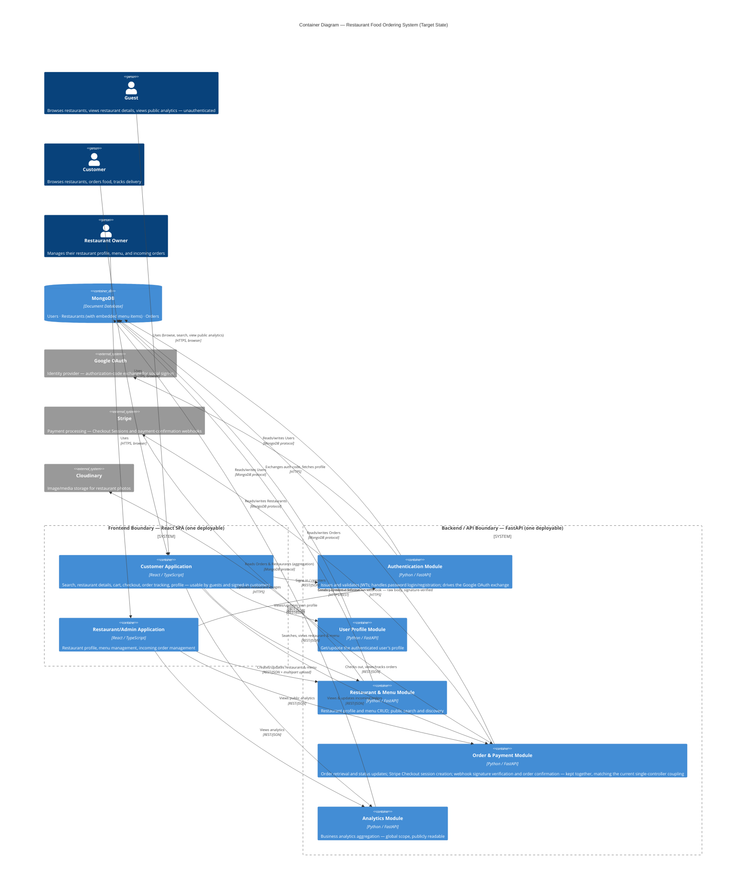

# Target Architecture — C4 Container Diagram
## Restaurant Food Ordering Management System — Backend Modernization (Node.js/Express → Python/FastAPI)

**Module:** 2 — Architecture & Solution Design
**Basis:** `TARGET_ARCHITECTURE.md` (approved). **Revision:** incorporates corrections from the architecture design review (5 backend modules instead of 4 — Payment merged into Order per the approved architecture's explicit coupling note; Analytics restored as its own module; User Profile module added; Guest actor added; raw-body webhook detail and robohash.org footnote added).

---

## Diagram

**Deliberately excluded from the diagram:** robohash.org (default avatar fallback) is a confirmed integration, but it is called directly from the browser and never touches the backend — it is omitted from this container view for that reason, not overlooked (`TARGET_ARCHITECTURE.md` §6).

---

## Architecture Explanation

Two boundaries matter most, both unchanged from the approved architecture:

- **Frontend Boundary:** one React SPA, one deployable artifact. "Customer Application" and "Restaurant/Admin Application" are drawn separately by responsibility, but are **not separately built or deployed** — they are route-gated view-sets in the same codebase and build output.
- **Backend/API Boundary:** one FastAPI service, one deployable artifact, containing five logical modules. These are **not microservices** — they are internal module boundaries within a single process. The module count and grouping were corrected during review to match `TARGET_ARCHITECTURE.md` exactly: Order and Payment stay together (they share one controller today and splitting them was an unjustified invented decomposition); Analytics stands alone (it was incorrectly merged into Order Management in an earlier draft); User Profile now has its own module (it was missing entirely in an earlier draft).

## Component Responsibilities

| Component | Responsibility | Confirmed source |
|---|---|---|
| Customer Application | Browse/search restaurants, build a cart, initiate checkout, view/track orders, manage own profile — usable by guests for browsing/public analytics and by signed-in customers for the rest | `BROWNFIELD_UI_UX_HANDOFF.md` §4 |
| Restaurant/Admin Application | Create/edit restaurant profile and menu, view incoming orders, update order status, view business analytics | `BROWNFIELD_UI_UX_HANDOFF.md` §4 |
| Authentication Module | Issue/validate JWTs, handle password register/login, drive the Google OAuth exchange, expose the auth dependency used by every protected route | `CURRENT_STATE.md` §5 |
| User Profile Module | Get/update the authenticated user's own profile | `CURRENT_STATE.md` §3, PRD.md PF-07–PF-09 |
| Restaurant & Menu Module | Restaurant CRUD (incl. embedded menu items, Cloudinary upload), public restaurant discovery/search | `CURRENT_STATE.md` §3, §7 |
| Order & Payment Module | Customer order retrieval, owner order status updates, Stripe Checkout session creation, raw-body webhook verification and order confirmation | `CURRENT_STATE.md` §3, §6 |
| Analytics Module | Global business analytics aggregation, publicly readable | `CURRENT_STATE.md` §3, §8 |
| MongoDB | System of record for Users, Restaurants (embedded menu items), Orders — schema unchanged | `CURRENT_STATE.md` §4 |
| Google OAuth | External identity verification only — backend still issues/owns its own JWTs | `CURRENT_STATE.md` §5 |
| Stripe | External payment processor; the system's only inbound, asynchronous, third-party-initiated call | `CURRENT_STATE.md` §6 |
| Cloudinary | External image hosting for restaurant photos | `CURRENT_STATE.md` §7 |

## Major Data Flows

1. **Sign-in (password):** Customer/Owner App → Authentication Module → MongoDB → JWT returned.
2. **Sign-in (Google):** Customer/Owner App → Authentication Module → Google (code exchange + profile fetch) → MongoDB (upsert user) → backend-issued JWT via redirect.
3. **Profile view/update:** Customer App → User Profile Module → MongoDB.
4. **Restaurant/menu management:** Admin App → Restaurant & Menu Module → Cloudinary (image upload) → MongoDB.
5. **Checkout:** Customer App → Order & Payment Module → Stripe (create Checkout Session) → MongoDB (order persisted only after Stripe confirms) → browser redirected to Stripe.
6. **Payment confirmation:** Stripe → Order & Payment Module (signed webhook, **raw body read before any JSON parsing**) → MongoDB (status → "paid", total updated) — the only flow initiated by an external system.
7. **Order tracking / owner order view:** Customer/Admin App polls the Order & Payment Module every 5 seconds → MongoDB → latest status returned. No push channel exists.
8. **Analytics:** Guest/Customer/Owner App → Analytics Module → MongoDB (aggregation) — identical output whether authenticated or not.

## Assumptions

- Identity/auth is built around the confirmed current mechanism (backend-issued JWT + server-side Google OAuth) — Auth0 is not part of this architecture, per explicit decision.
- The Customer and Restaurant/Admin "applications" remain a single SPA build.
- The five backend modules remain logical boundaries inside one FastAPI process — not independently deployed services.
- No new external system, cache, queue, or orchestration layer is introduced.

## Unresolved Questions

- Deployment platform for the backend/frontend containers (Render/Netlify vs. Coolify) — unconfirmed.
- Choice of async MongoDB driver/ODM for the Python backend — unspecified.
- Secrets-management approach for the target deployment — unspecified.
- Whether the backend runs as multiple instances, affecting the health-check/uptime design — unresolved.
- Product-level decisions gated behind Jira Story **RFOMS-2** (analytics scope, debug-endpoint disposition, dead cookie/`state`-param handling, delivery `country` field, validation-error shape, non-Stripe-error handling, additional Stripe event types).
