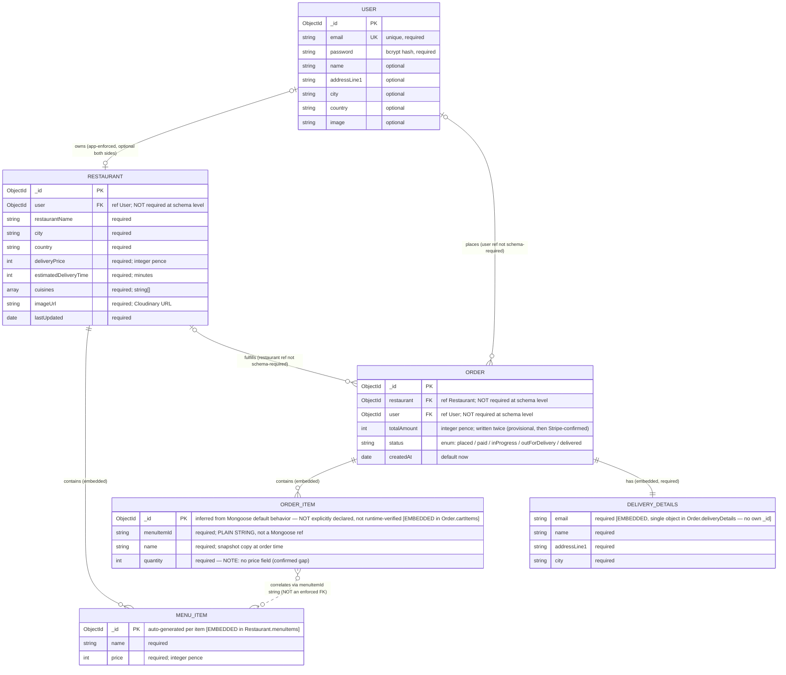

# Target Entity Relationship Diagram
## Restaurant Food Ordering Management System — Backend Modernization

**Module:** 2 — Architecture & Solution Design
**Basis:** `ARCHITECTURE_REQUIREMENTS.md` (approved) §10 Data Requirements, and direct inspection of `food-ordering-backend/src/models/{user,restaurant,order}.ts`.

**Governing constraint:** no database migration is in scope (`BRD.md` §11, `PRD.md` §11). The target data model is therefore **schema-identical to the current state** — this diagram documents that model with explicit keys and cardinality; it does not redesign it. Two confirmed gaps are annotated, not silently fixed.

**Revision note:** incorporates corrections from the architecture design review — three relationships' cardinality symbols corrected to reflect that the underlying reference fields are not schema-`required`, and `ORDER_ITEM._id`'s confidence level downgraded to reflect that it is inferred from Mongoose's default behavior rather than explicitly declared in the schema.

---

## How to read "entity" here

MongoDB is document-oriented: `Restaurant` embeds its menu items, `Order` embeds its cart items and delivery details. An ER diagram conventionally shows logical entities and relationships regardless of physical storage, so embedded structures are drawn as entities below — but every embedded entity is explicitly labeled **[EMBEDDED]**, distinct from the three real top-level collections **[COLLECTION]**. Do not read an embedded box as a separate MongoDB collection.

---

## Target ER Diagram

---

## Entity Notes

### USER `[COLLECTION]`
Confirmed from `models/user.ts`. `email` is the only unique-indexed field. No `role` field — "restaurant owner" is not a stored attribute; it is inferred at query time from the existence of a `Restaurant` document referencing this user. Password is bcrypt-hashed (cost 8) in a `pre("save")` hook.

### RESTAURANT `[COLLECTION]`
Confirmed from `models/restaurant.ts`. `user` is a Mongoose `ref` to `User` but is **not** schema-`required` — the field could theoretically be absent, though application logic always sets it on create. There is **no unique index on `user`** — the one-restaurant-per-user rule is enforced only by an application-level existence check before insert, not by the database (a known race-condition characteristic, already logged as an open item, not resolved here).

### MENU_ITEM `[EMBEDDED — Restaurant.menuItems[]]`
Not a collection. Each subdocument gets its own auto-generated `_id`, which is what `Order.cartItems[].menuItemId` correlates against. A menu item cannot exist independent of its parent `Restaurant` — deleting/replacing the restaurant document removes its menu items with it.

### ORDER `[COLLECTION]`
Confirmed from `models/order.ts`. Like `Restaurant.user`, both `restaurant` and `user` are `ref`s but **not** schema-`required`. `status` has **no schema-level default** — the controller always sets `"placed"` explicitly on creation. `totalAmount` is written twice in the order lifecycle: a provisional app-computed value at checkout-session creation, then overwritten by Stripe's authoritative `amount_total` via the webhook — both write to the same field, there is no history of the two values.

### ORDER_ITEM `[EMBEDDED — Order.cartItems[]]`
Not a collection. `menuItemId` is a **plain `String`, not a Mongoose `ObjectId` ref** — there is no referential integrity between an order item and the menu item it came from; it is a point-in-time string correlation only, matched by the application at checkout. **Confirmed gap:** no `price` field is persisted per line item — only the order-level `totalAmount` aggregate survives, so a historical order cannot show what each item cost if the menu price later changes. **Confidence note:** its `_id` primary key is inferred from documented Mongoose default behavior (arrays of subdocuments get an auto `_id` unless disabled), not explicitly declared in `order.ts` and not runtime-verified — lower confidence than `MENU_ITEM._id`, which is explicitly declared.

### DELIVERY_DETAILS `[EMBEDDED — Order.deliveryDetails, single object]`
Not a collection, not an array — a single required embedded object, so it has no `_id` of its own. **Confirmed gap:** has no `country` field, even though the frontend's `UserProfileForm` collects `country` and sends it in this exact payload at checkout — it is silently dropped by Mongoose's default strict-mode behavior on write. **Design observation, not a defect:** its fields (email, name, addressLine1, city) substantially duplicate `USER`'s shape. This is an intentional snapshot — the order captures delivery information as it was at order time rather than referencing the live, possibly-later-edited user record — and should not be "normalized away" as part of this modernization.

---

## Relationship & Cardinality Notes

| Relationship | Cardinality | Enforcement |
|---|---|---|
| User owns Restaurant | 0..1 User : 0..1 Restaurant | **Application-level only** — no unique index; schema field itself is optional on both sides |
| Restaurant contains Menu Item | 1 Restaurant : 0..N Menu Item | Structural (embedding) — a menu item cannot exist without its restaurant |
| User places Order | 0..1 User : 0..N Order | Referenced via `Order.user`, not schema-required |
| Restaurant fulfills Order | 0..1 Restaurant : 0..N Order | Referenced via `Order.restaurant`, not schema-required |
| Order contains Order Item | 1 Order : 0..N Order Item | Structural (embedding); schema does not enforce a minimum of one item |
| Order has Delivery Details | 1 Order : exactly 1 Delivery Details | Structural (embedding), required fields enforce presence of the object |
| Order Item correlates to Menu Item | 0..N : 0..N, non-identifying | **Not enforced anywhere** — a plain string match at checkout time only; drawn dashed deliberately |

---

## Entities Considered and Explicitly Not Modeled

Per instruction not to add entities merely because they're common in food-delivery systems, each requested category was checked against the actual repository and either mapped above or excluded here with the reason:

| Requested category | Finding |
|---|---|
| **Payments** | **No local `Payment` entity exists or is proposed.** Stripe is the external system of record for transaction detail (session, payment intent, charge). The local database stores only the *outcome* on `Order`: `totalAmount` and `status`. Notably, **no Stripe session/payment-intent identifier is persisted on `Order` at all** — the webhook locates the order via `metadata.orderId` (the Mongo `Order._id`, passed *to* Stripe at session creation), but nothing is written *back* linking the Order to a Stripe transaction ID. This means the database alone cannot answer "which Stripe transaction paid for this order" — a genuine characteristic of the current model, not something this diagram invents or silently fixes. |
| **Reviews/ratings** | **No such entity exists anywhere in the repository** — no model, no schema field, no UI, no route. Not included, and not proposed, since nothing in `BRD.md`, `PRD.md`, or the repository supports it. |
| **Addresses/delivery information** | Modeled above as `DELIVERY_DETAILS` (embedded, order-scoped) and as flat, non-repeatable fields (`addressLine1`, `city`, `country`) directly on `USER`. **There is no standalone `Address` entity or support for multiple saved addresses per user** — introducing one would be a schema change beyond what's approved, so it is not modeled. |

---

## Existing vs. Proposed — Explicit Statement

**Every entity, field, key, and relationship in this diagram already exists in the current MERN system.** Nothing here is a proposed modernization change to the data model — that would require a schema migration, which is out of scope (`BRD.md` §11). The only "changes" this document makes relative to the raw current-state schema are documentation choices:

- Making primary/foreign keys explicit where the Mongoose schema leaves them implicit.
- Distinguishing enforced (`ref`) relationships from unenforced (plain string) correlations.
- Flagging two confirmed data gaps (`DELIVERY_DETAILS.country`, `ORDER_ITEM.price`) inline rather than silently reproducing or silently fixing them.

Any actual change to this model — adding a `country` field, persisting per-line price, adding a uniqueness constraint on `Restaurant.user`, or introducing any new entity — remains gated behind the open questions already logged in `ARCHITECTURE_REQUIREMENTS.md` §21 and Jira Story **RFOMS-2**, none of which are resolved by this diagram.
